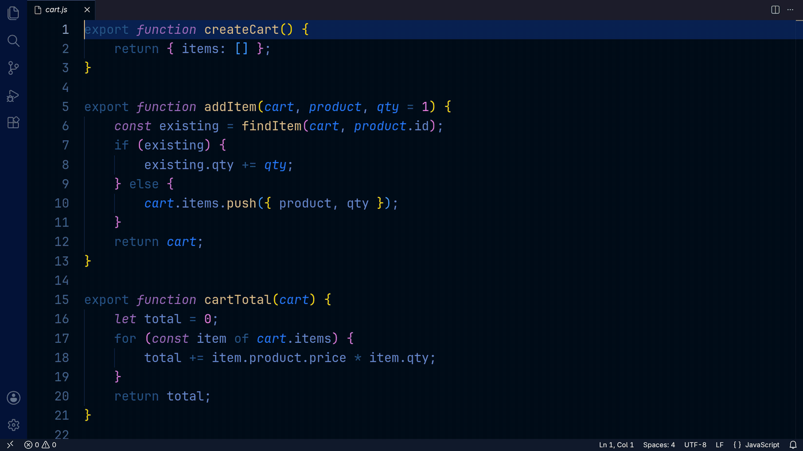

# Simple Blame

Toggle a whole-file Git blame view right in your editor. See who last changed every line without opening a side panel.

## Features

- **Toggle on/off** from the `Blame: ON/OFF` status bar button or the command palette: **Simple Blame: Toggle Inline Blame**.
- **Clean inline annotations** in aligned `commit  author  age` columns, shown once per block of lines from the same commit.
- **Recent changes stand out**: ages like `3 months ago`, with older commits faded.
- **Follows your edits**: blame updates as you type, and uncommitted lines are dimmed and marked `uncommitted`.
- **Hover actions**: full commit details with **Copy hash**, **Show diff**, and **Open on GitHub / GitLab / Bitbucket**.
- **Every visible editor**, including split views.
- **Quiet**: if a file can't be blamed, the status bar tells you why instead of showing pop-ups.
- **Submodule aware**, including workspaces opened through symlinks.
- **Lightweight**: does nothing while blame is off.

## Requirements

- Git installed and on your `PATH`.
- The file must be in a Git repository with at least one commit.

## Known Issues

- Very large files may take a moment to blame.
- Binary files are not supported.

Report issues on [GitHub](https://github.com/mashurr/simple-blame/issues).

## Release Notes

See [CHANGELOG.md](CHANGELOG.md).
